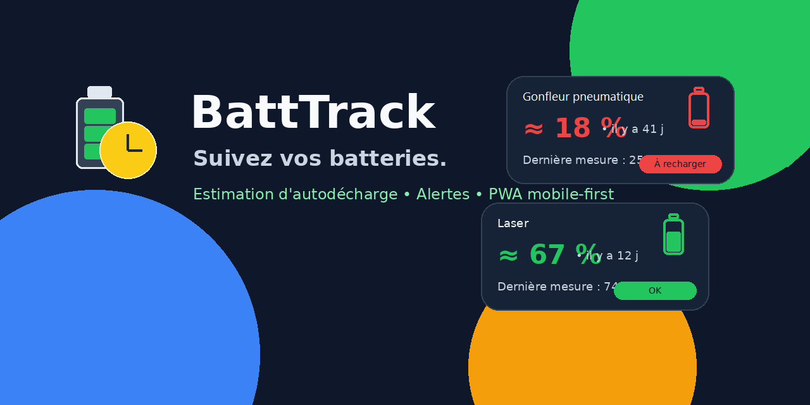
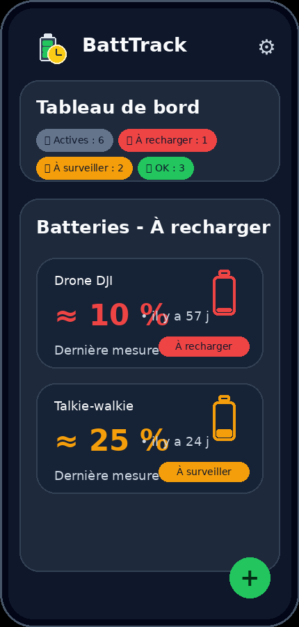
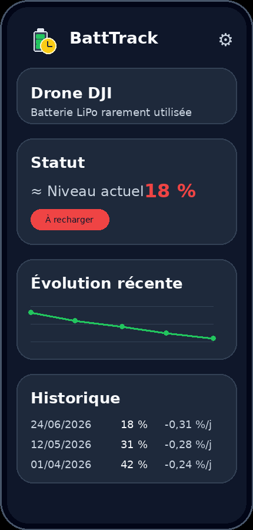
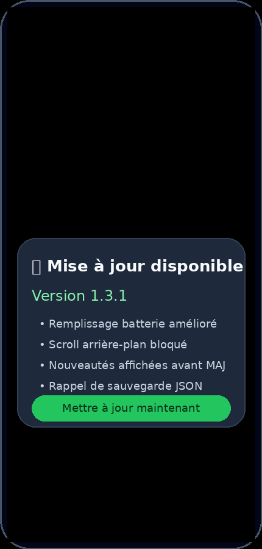
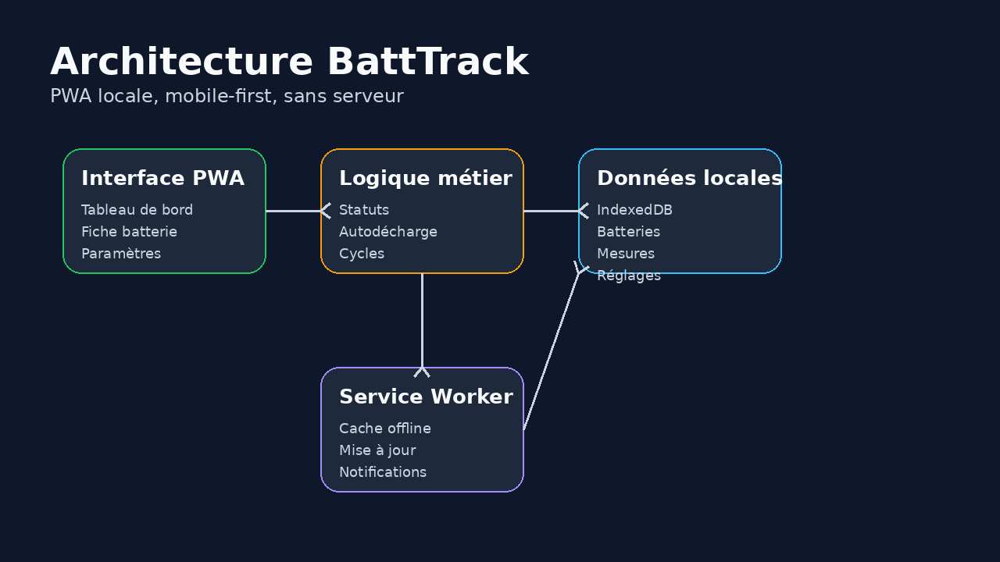

# Visuels README - BattTrack

Copier/coller ce bloc dans le `README.md` principal du repo.

```md
<p align="center">
  
</p>

# BattTrack

**BattTrack** est une PWA mobile-first pour suivre les batteries rarement utilisées, estimer leur autodécharge et éviter les décharges profondes.

<p align="center">
  
  
  
</p>

## Fonctionnalités

- 🔋 Suivi de batteries rarement utilisées
- 📈 Estimation d'autodécharge
- 🟢🟠🔴 Statuts visuels
- 💾 Export / import JSON
- 📱 PWA installable sur smartphone
- 🔄 Mise à jour avec affichage des nouveautés
- 🛡️ Notifications locales simples

## Architecture

<p align="center">
  
</p>
```

## Fichiers inclus

```text
assets/images/
├── architecture.png
├── banner.png
├── icons-showcase.png
├── logo.svg
├── screenshot-battery-detail.png
├── screenshot-dashboard.png
└── screenshot-update-modal.png
```
